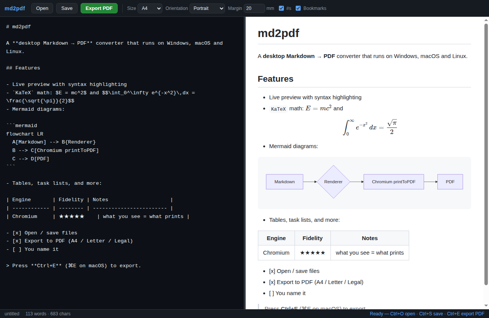

# md2pdf

[](https://github.com/BoogonClothman/md2pdf/actions/workflows/ci.yml)

Markdown → PDF 桌面应用（Windows / macOS / Linux）。

Electron 桌面 GUI：分栏编辑器 + 实时预览，PDF 导出走 Chromium
`printToPDF()` 所见即所得渲染（KaTeX 公式、Mermaid 图表、代码高亮、表格、
页码、书签大纲）。浅色 UI；会话记忆——草稿、上次打开的文件与导出设置
自动存入 localStorage，下次启动恢复（首次启动显示内置示例，可在
Help → Load Sample Document 重新加载）。



## 开发

```bash
npm install
npm run dev        # 构建并在桌面启动（WSLg 下窗口直接出现在 Windows 桌面）
npm run typecheck  # tsc --noEmit
npm run verify:notes  # Agent Notes 机制门禁（结构/格式/链接）
npm run verify     # 11 项自动化验证（PDF/截图/几何断言/退出路径/安全守卫）
```

开发约定与 [Agent Notes](.agents/notes/README.md)（决策留痕机制）见
[AGENTS.md](AGENTS.md)。

## 打包

```bash
npm run dist:linux   # AppImage + deb   （任意平台可构建）
npm run dist:win     # NSIS 安装器       （Linux 上需 wine64，见下）
npm run dist:mac     # dmg               （只能在 macOS 上构建）
```

产物输出到 `release/`。

| 平台 | 产物 | 备注 |
|---|---|---|
| Linux | `md2pdf-*-linux-x86_64.AppImage`、`*-linux-amd64.deb` | ✅ CI/Linux 直接构建 |
| Windows | `md2pdf-*-win-x64.exe` (NSIS) | Linux 上构建需 `sudo apt install wine64`；或在 Windows 机器直接 `npm run dist:win` |
| Windows 便携版 | `md2pdf-*-win-x64-portable.zip` | 无需 wine 即可产出（`win-unpacked` 打包） |
| macOS | `md2pdf-*-mac-*-.dmg` | **必须在 macOS 上构建**（签名/公证限制） |

运行库依赖（markdown-it / katex / mermaid 等）全部由 esbuild 打进 bundle，
安装包 asar 内只有 `dist/`，不含 `node_modules`。

### 镜像说明

`.npmrc` 使用 npmmirror（npmmirror 镜像 electron 与 electron-builder
二进制）。在 npm 13 之前 `electron_mirror` 这类非官方键会产生警告，属已知
技术债。手动构建时也可显式传环境变量：

```bash
ELECTRON_MIRROR=https://npmmirror.com/mirrors/electron/ \
ELECTRON_BUILDER_BINARIES_MIRROR=https://npmmirror.com/mirrors/electron-builder-binaries/ \
npm run dist:linux
```

## 发行

发行说明**手写**、按版本归档在 [`docs/releases/`](docs/releases/)，文件名必须
等于 tag（如 `docs/releases/v0.2.0.md`）。GitHub Release 的正文直接取自该文件
——想翻任意历史版本的发行文档，仓库里就有，不用去 GitHub 上爬。

发新版四步：

```bash
$EDITOR docs/releases/v0.2.0.md              # 1. 写发行文档
npm version 0.2.0 --no-git-tag-version       # 2. 同步 package.json 版本号
git commit -am "release: v0.2.0"             # 3. 提交
git tag v0.2.0 && git push origin main v0.2.0  # 4. 打 tag 并推送
```

推送 tag 后 `release.yml` 自动执行：

1. **preflight** —— 校验 `docs/releases/<tag>.md` 存在、tag == `v` +
   package.json 版本号；不满足立刻失败，不白跑三平台构建
2. **build** —— 复用 CI 流水线（typecheck / verify / 三平台打包）
3. **publish** —— 生成 `SHA256SUMS.txt`，以文档为正文创建 Release 并上传
   全部安装包；含 `-` 的 tag（如 `v0.2.0-rc.1`）自动标为 pre-release；
   重跑会按最新文档刷新正文并覆盖资产

## 架构

```
src/
├── main/          Electron 主进程
│   ├── main.ts       窗口/菜单/文件对话框/IPC
│   ├── export.ts     隐藏窗口 + printToPDF 导出管线
│   ├── security.ts   导航/弹窗守卫（防不可信 markdown 逃逸到远程源）
│   ├── switches.ts   平台相关 Chromium 开关（WSL 检测等）
│   └── verify.ts     自动化验证入口
├── preload/       contextBridge 白名单 API
├── renderer/      编辑器 + 实时预览 + 导出页
└── shared/        markdown 管线（Node/浏览器双端可用）
```

### 安全模型

- 无 HTTP 服务、不监听任何端口（`file://` 直载），CSP `connect-src 'none'`
- `contextIsolation` + `sandbox` + `nodeIntegration: false`
- `will-navigate` 仅允许 `dist/renderer` 下的 `file://`；弹窗一律拒绝
- 外链经 IPC 白名单（仅 `https?`/`mailto`）交给系统浏览器

### 历史决策记录

- `markdown-it-katex`（waylonflinn，2016 年后停更，硬依赖 katex@0.6）
  导致 HTML/CSS 版本错配 → 上标错位；已换用微软维护的
  `@vscode/markdown-it-katex`。自研渲染器保留在 commit `2f6081b`。
- Electron `printToPDF` 的 `margins` 文档写 pixels，实际是 **inches**
  （实测确认，见 `src/main/export.ts` 注释）。
